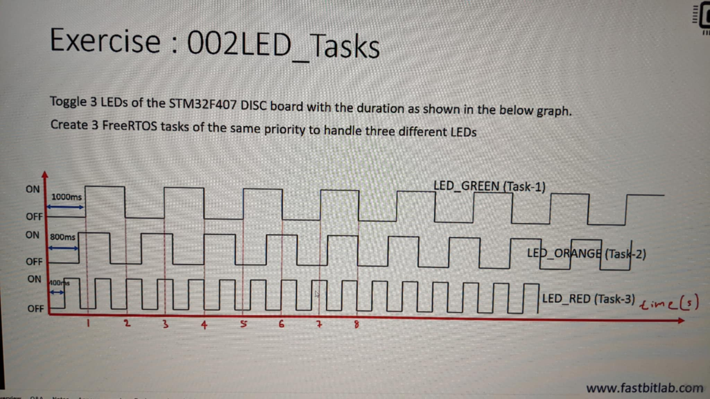

Initial commit

*Reference list*
[1]: https://www.freertos.org/Documentation 

sysmem.c which handles heap managemant will not be used within this project 
--> portable/MemMang will handle them instead 
--> as they are designed to allocate RTOS threads on heap

Check datatype defined by FreeRTOS Kernel, check size
  configSTACK_DEPTH_TYPE --> uint16_t

REMEMBER to config PRIORITIES: [0 -> (configMAX_PRIORITIES - 1)]
configMAX_PRIORITIES locates in FreeRTOSConfig.h

### EXERCISE 1
Creates 2 tasks: 
Task-1
Task-2
with equal priorities --> print msg "Hello world from task-x"
- PRIORITY = 4 bit for pre-emption --> 5 = MAX for system Exception from FreeRTOS
- > 5 for others
- configUSE_PREEMPTION for PREEMPTION Scheduler config
- TaskYeild -> force (active) to (ready)
- task Suspend  -> force (all states) to suspend
- taskDelay -> force to block state

### TRACE TOOL INTEGRATE
- Get source files from FreeRTOS 10.4 version (in samples)
- from FreeRTOS 11 there's no need to apply patch

- **NOTE**: Patch is obsolete, needs manual update. 

- Remember to update MCU Core, RTT buffer size, app name and MCU name
- SEGGER will use CYCLE_COUNTER of CPU as a source of timestamp to display to user -> remember to update this   
- DWT_CYCCNT register stores the number of clock cycles happended after the CPU reset 
--> how to enable: Cortex-M4 user manual
--> get _SEGGER_RTT buffer --> pu1 & Write offset and save raw binary files 
--> import to tool for use

SEGGER offers an API SEGGER_SYSVIEW_PrintfTarget() to record printf calls from target
note: SEGGER_SYSVIEW_PrintfTarget must take formatted string
You can make use of snprintf to format for your string before hand

### EXERCISE 

Approaches: 
- an enormous main loop: 
  + Complex Logic 
  + Uses blocking delay  
  + Consumes more power (CPU is always engaged)
- Timer ISR:
  + Processor engaged once every 100ms 
  + All work is done in handler mode (privileged access level)
- RTOS solution:
  + User code runs in thread mode of the processor 
  + Task management is required (RTOS Kernel)
  + Lower power (CPU is not always engaged)

remember to add new source files configuration for SW build in STM32CubeIDE
RTOS_STM32/bg/Inc/task1.hpp 
RTOS_STM32/bg/Inc/task2.hpp 
RTOS_STM32/bg/Inc/task3.hpp 
RTOS_STM32/bg/Src/task1.cpp 
RTOS_STM32/bg/Src/task2.cpp 
RTOS_STM32/bg/Src/task3.cpp 

